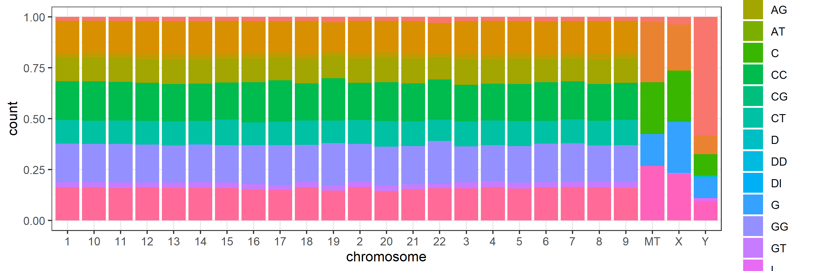
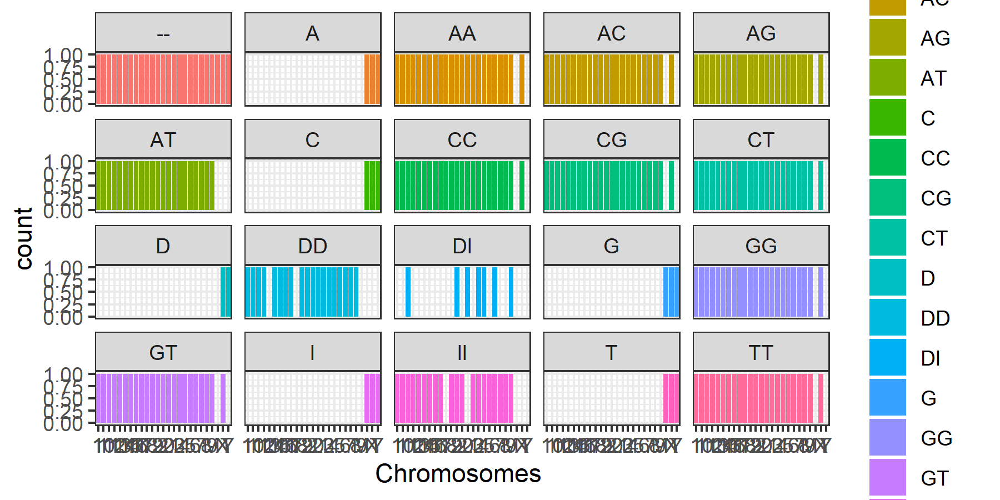

Examples
```{r}
library(ggplot2)
library(tidyverse)
library(plotly)
library(DT)
###############################################################################Title

bp <- ggplot(PlantGrowth, aes(x=group, y=weight)) + geom_boxplot()
bp

bp + ggtitle("Plant growth")
## Equivalent to
# bp + labs(title="Plant growth")

# If the title is long, it can be split into multiple lines with \n
bp + ggtitle("Plant growth with\ndifferent treatments")

# Reduce line spacing and use bold text
bp + ggtitle("Plant growth with\ndifferent treatments") + 
     theme(plot.title = element_text(lineheight=.8, face="bold"))

###############################################################################Axes 
bp <- ggplot(PlantGrowth, aes(x=group, y=weight)) +
    geom_boxplot()
bp

bp + coord_flip()

# Manually set the order of a discrete-valued axis
bp + scale_x_discrete(limits=c("trt1","trt2","ctrl"))

# Reverse the order of a discrete-valued axis
# Get the levels of the factor
flevels <- levels(PlantGrowth$group)
flevels
#> [1] "ctrl" "trt1" "trt2"

# Reverse the order
flevels <- rev(flevels)
flevels
#> [1] "trt2" "trt1" "ctrl"

bp + scale_x_discrete(limits=flevels)

# Or it can be done in one line:
bp + scale_x_discrete(limits = rev(levels(PlantGrowth$group)))

bp + scale_x_discrete(breaks=c("ctrl", "trt1", "trt2"),
                      labels=c("Control", "Treat 1", "Treat 2"))

# Hide x tick marks, labels, and grid lines
bp + scale_x_discrete(breaks=NULL)

# Hide all tick marks and labels (on X axis), but keep the gridlines
bp + theme(axis.ticks = element_blank(), axis.text.x = element_blank())

# Make sure to include 0 in the y axis
bp + expand_limits(y=0)

# Make sure to include 0 and 8 in the y axis
bp + expand_limits(y=c(0,8))

# Set the range of a continuous-valued axis
# These are equivalent
bp + ylim(0, 8)
# bp + scale_y_continuous(limits=c(0, 8))

# These two do the same thing; all data points outside the graphing range are
# dropped, resulting in a misleading box plot
bp + ylim(5, 7.5)
#> Warning: Removed 13 rows containing non-finite values (stat_boxplot).
# bp + scale_y_continuous(limits=c(5, 7.5))

# Using coord_cartesian "zooms" into the area
bp + coord_cartesian(ylim=c(5, 7.5))

# Specify tick marks directly
bp + coord_cartesian(ylim=c(5, 7.5)) + 
    scale_y_continuous(breaks=seq(0, 10, 0.25))  # Ticks from 0-10, every .25

# Reverse order of a continuous-valued axis
bp + scale_y_reverse()

# Setting the tick marks on an axis
# This will show tick marks on every 0.25 from 1 to 10
# The scale will show only the ones that are within range (3.50-6.25 in this case)
bp + scale_y_continuous(breaks=seq(1,10,1/4))

# The breaks can be spaced unevenly
bp + scale_y_continuous(breaks=c(4, 4.25, 4.5, 5, 6,8))

# Suppress ticks and gridlines
bp + scale_y_continuous(breaks=NULL)

# Hide tick marks and labels (on Y axis), but keep the gridlines
bp + theme(axis.ticks = element_blank(), axis.text.y = element_blank())

# Create some noisy exponentially-distributed data
set.seed(201)
n <- 100
dat <- data.frame(
    xval = (1:n+rnorm(n,sd=5))/20,
    yval = 2*2^((1:n+rnorm(n,sd=5))/20)
)

# A scatterplot with regular (linear) axis scaling
sp <- ggplot(dat, aes(xval, yval)) + geom_point()
sp

# log2 scaling of the y axis (with visually-equal spacing)
library(scales)     # Need the scales package
sp + scale_y_continuous(trans=log2_trans())

# log2 coordinate transformation (with visually-diminishing spacing)
sp + coord_trans(y="log2")

sp + scale_y_continuous(trans = log2_trans(),
                        breaks = trans_breaks("log2", function(x) 2^x),
                        labels = trans_format("log2", math_format(2^.x)))
set.seed(205)
n <- 100
dat10 <- data.frame(
    xval = (1:n+rnorm(n,sd=5))/20,
    yval = 10*10^((1:n+rnorm(n,sd=5))/20)
)

sp10 <- ggplot(dat10, aes(xval, yval)) + geom_point()

# log10
sp10 + scale_y_log10()

# log10 with exponents on tick labels
sp10 + scale_y_log10(breaks = trans_breaks("log10", function(x) 10^x),
                     labels = trans_format("log10", math_format(10^.x)))

# Data where x ranges from 0-10, y ranges from 0-30
set.seed(202)
dat <- data.frame(
    xval = runif(40,0,10),
    yval = runif(40,0,30)
)
sp <- ggplot(dat, aes(xval, yval)) + geom_point()

# Force equal scaling
sp + coord_fixed()

# Equal scaling, with each 1 on the x axis the same length as y on x axis
sp + coord_fixed(ratio=1/3)

bp + theme(axis.title.x = element_blank()) +   # Remove x-axis label
     ylab("Weight (Kg)")                       # Set y-axis label

# Also possible to set the axis label with the scale
# Note that vertical space is still reserved for x's label
bp + scale_x_discrete(name="") +
     scale_y_continuous(name="Weight (Kg)")

# Change font options:
# X-axis label: bold, red, and 20 points
# X-axis tick marks: rotate 90 degrees CCW, move to the left a bit (using vjust,
#   since the labels are rotated), and 16 points
bp + theme(axis.title.x = element_text(face="bold", colour="#990000", size=20),
           axis.text.x  = element_text(angle=90, vjust=0.5, size=16))

# Label formatters
library(scales)   # Need the scales package
bp + scale_y_continuous(labels=percent) +
     scale_x_discrete(labels=abbreviate)  # In this particular case, it has no effect

# Self-defined formatting function for times.
timeHMS_formatter <- function(x) {
    h <- floor(x/60)
    m <- floor(x %% 60)
    s <- round(60*(x %% 1))                   # Round to nearest second
    lab <- sprintf('%02d:%02d:%02d', h, m, s) # Format the strings as HH:MM:SS
    lab <- gsub('^00:', '', lab)              # Remove leading 00: if present
    lab <- gsub('^0', '', lab)                # Remove leading 0 if present
}

bp + scale_y_continuous(label=timeHMS_formatter)

# Hide all the gridlines
bp + theme(panel.grid.minor=element_blank(),
           panel.grid.major=element_blank())

# Hide just the minor gridlines
bp + theme(panel.grid.minor=element_blank())

# Hide all the vertical gridlines
bp + theme(panel.grid.minor.x=element_blank(),
           panel.grid.major.x=element_blank())

# Hide all the horizontal gridlines
bp + theme(panel.grid.minor.y=element_blank(),
           panel.grid.major.y=element_blank())
###############################################################################Legend

# Remove legend for a particular aesthetic (fill)
bp + guides(fill=FALSE)

# It can also be done when specifying the scale
bp + scale_fill_discrete(guide=FALSE)

# This removes all legends
bp + theme(legend.position="none")

bp + scale_fill_discrete(breaks=c("trt1","ctrl","trt2"))

# These two methods are equivalent:
bp + guides(fill = guide_legend(reverse=TRUE))
bp + scale_fill_discrete(guide = guide_legend(reverse=TRUE))

# You can also modify the scale directly:
bp + scale_fill_discrete(breaks = rev(levels(PlantGrowth$group)))

# Remove title for fill legend
bp + guides(fill=guide_legend(title=NULL))

# Remove title for all legends
bp + theme(legend.title=element_blank())

bp + scale_fill_discrete(name="Experimental\nCondition")

bp + scale_fill_discrete(name="Experimental\nCondition",
                         breaks=c("ctrl", "trt1", "trt2"),
                         labels=c("Control", "Treatment 1", "Treatment 2"))

# Using a manual scale instead of hue
bp + scale_fill_manual(values=c("#999999", "#E69F00", "#56B4E9"), 
                       name="Experimental\nCondition",
                       breaks=c("ctrl", "trt1", "trt2"),
                       labels=c("Control", "Treatment 1", "Treatment 2"))

# A different data set
df1 <- data.frame(
    sex = factor(c("Female","Female","Male","Male")),
    time = factor(c("Lunch","Dinner","Lunch","Dinner"), levels=c("Lunch","Dinner")),
    total_bill = c(13.53, 16.81, 16.24, 17.42)
)

# A basic graph
lp <- ggplot(data=df1, aes(x=time, y=total_bill, group=sex, shape=sex)) + geom_line() + geom_point()
lp

# Change the legend
lp + scale_shape_discrete(name  ="Payer",
                          breaks=c("Female", "Male"),
                          labels=c("Woman", "Man"))

# Specify colour and shape
lp1 <- ggplot(data=df1, aes(x=time, y=total_bill, group=sex, shape=sex, colour=sex)) + geom_line() + geom_point()
lp1

# Here's what happens if you just specify colour
lp1 + scale_colour_discrete(name  ="Payer",
                            breaks=c("Female", "Male"),
                            labels=c("Woman", "Man"))

# Specify both colour and shape
lp1 + scale_colour_discrete(name  ="Payer",
                            breaks=c("Female", "Male"),
                            labels=c("Woman", "Man")) +
      scale_shape_discrete(name  ="Payer",
                           breaks=c("Female", "Male"),
                           labels=c("Woman", "Man"))

pg <- PlantGrowth    # Copy data into new data frame
# Rename the column and the values in the factor
levels(pg$group)[levels(pg$group)=="ctrl"] <- "Control"
levels(pg$group)[levels(pg$group)=="trt1"] <- "Treatment 1"
levels(pg$group)[levels(pg$group)=="trt2"] <- "Treatment 2"
names(pg)[names(pg)=="group"]  <- "Experimental Condition"

# View a few rows from the end product
head(pg)
#>   weight Experimental Condition
#> 1   4.17                Control
#> 2   5.58                Control
#> 3   5.18                Control
#> 4   6.11                Control
#> 5   4.50                Control
#> 6   4.61                Control

# Make the plot 
ggplot(data=pg, aes(x=`Experimental Condition`, y=weight, fill=`Experimental Condition`)) +
    geom_boxplot()

# Title appearance
bp + theme(legend.title = element_text(colour="blue", size=16, face="bold"))

# Label appearance
bp + theme(legend.text = element_text(colour="blue", size = 16, face = "bold"))

bp + theme(legend.background = element_rect())
bp + theme(legend.background = element_rect(fill="gray90", size=.5, linetype="dotted"))

bp + theme(legend.position="top")

# Position legend in graph, where x,y is 0,0 (bottom left) to 1,1 (top right)
bp + theme(legend.position=c(.5, .5))

# Set the "anchoring point" of the legend (bottom-left is 0,0; top-right is 1,1)
# Put bottom-left corner of legend box in bottom-left corner of graph
bp + theme(legend.justification=c(0,0), legend.position=c(0,0))

# Put bottom-right corner of legend box in bottom-right corner of graph
bp + theme(legend.justification=c(1,0), legend.position=c(1,0))

# No outline
ggplot(data=PlantGrowth, aes(x=group, fill=group)) +
    geom_bar()

# Add outline, but slashes appear in legend
ggplot(data=PlantGrowth, aes(x=group, fill=group)) +
    geom_bar(colour="black")

# A hack to hide the slashes: first graph the bars with no outline and add the legend,
# then graph the bars again with outline, but with a blank legend.
ggplot(data=PlantGrowth, aes(x=group, fill=group)) +
    geom_bar() +
    geom_bar(colour="black", show.legend=FALSE)

###############################################################################Colors

# Remove legend for a particular aesthetic (fill)
bp + guides(fill=FALSE)

# It can also be done when specifying the scale
bp + scale_fill_discrete(guide=FALSE)

# This removes all legends
bp + theme(legend.position="none")

bp + scale_fill_discrete(breaks=c("trt1","ctrl","trt2"))


# These two methods are equivalent:
bp + guides(fill = guide_legend(reverse=TRUE))
bp + scale_fill_discrete(guide = guide_legend(reverse=TRUE))

# You can also modify the scale directly:
bp + scale_fill_discrete(breaks = rev(levels(PlantGrowth$group)))


# Remove title for fill legend
bp + guides(fill=guide_legend(title=NULL))

# Remove title for all legends
bp + theme(legend.title=element_blank())


bp + scale_fill_discrete(name="Experimental\nCondition")

bp + scale_fill_discrete(name="Experimental\nCondition",
                         breaks=c("ctrl", "trt1", "trt2"),
                         labels=c("Control", "Treatment 1", "Treatment 2"))

# Using a manual scale instead of hue
bp + scale_fill_manual(values=c("#999999", "#E69F00", "#56B4E9"), 
                       name="Experimental\nCondition",
                       breaks=c("ctrl", "trt1", "trt2"),
                       labels=c("Control", "Treatment 1", "Treatment 2"))


# A different data set
df1 <- data.frame(
    sex = factor(c("Female","Female","Male","Male")),
    time = factor(c("Lunch","Dinner","Lunch","Dinner"), levels=c("Lunch","Dinner")),
    total_bill = c(13.53, 16.81, 16.24, 17.42)
)

# A basic graph
lp <- ggplot(data=df1, aes(x=time, y=total_bill, group=sex, shape=sex)) + geom_line() + geom_point()
lp

# Change the legend
lp + scale_shape_discrete(name  ="Payer",
                          breaks=c("Female", "Male"),
                          labels=c("Woman", "Man"))

# Specify colour and shape
lp1 <- ggplot(data=df1, aes(x=time, y=total_bill, group=sex, shape=sex, colour=sex)) + geom_line() + geom_point()
lp1

# Here's what happens if you just specify colour
lp1 + scale_colour_discrete(name  ="Payer",
                            breaks=c("Female", "Male"),
                            labels=c("Woman", "Man"))

# Specify both colour and shape
lp1 + scale_colour_discrete(name  ="Payer",
                            breaks=c("Female", "Male"),
                            labels=c("Woman", "Man")) +
      scale_shape_discrete(name  ="Payer",
                           breaks=c("Female", "Male"),
                           labels=c("Woman", "Man"))

pg <- PlantGrowth    # Copy data into new data frame
# Rename the column and the values in the factor
levels(pg$group)[levels(pg$group)=="ctrl"] <- "Control"
levels(pg$group)[levels(pg$group)=="trt1"] <- "Treatment 1"
levels(pg$group)[levels(pg$group)=="trt2"] <- "Treatment 2"
names(pg)[names(pg)=="group"]  <- "Experimental Condition"

# View a few rows from the end product
head(pg)
#>   weight Experimental Condition
#> 1   4.17                Control
#> 2   5.58                Control
#> 3   5.18                Control
#> 4   6.11                Control
#> 5   4.50                Control
#> 6   4.61                Control

# Make the plot 
ggplot(data=pg, aes(x=`Experimental Condition`, y=weight, fill=`Experimental Condition`)) +
    geom_boxplot()

# Title appearance
bp + theme(legend.title = element_text(colour="blue", size=16, face="bold"))

# Label appearance
bp + theme(legend.text = element_text(colour="blue", size = 16, face = "bold"))

bp + theme(legend.background = element_rect())
bp + theme(legend.background = element_rect(fill="gray90", size=.5, linetype="dotted"))

bp + theme(legend.position="top")

# Position legend in graph, where x,y is 0,0 (bottom left) to 1,1 (top right)
bp + theme(legend.position=c(.5, .5))

# Set the "anchoring point" of the legend (bottom-left is 0,0; top-right is 1,1)
# Put bottom-left corner of legend box in bottom-left corner of graph
bp + theme(legend.justification=c(0,0), legend.position=c(0,0))

# Put bottom-right corner of legend box in bottom-right corner of graph
bp + theme(legend.justification=c(1,0), legend.position=c(1,0))

# No outline
ggplot(data=PlantGrowth, aes(x=group, fill=group)) +
    geom_bar()

# Add outline, but slashes appear in legend
ggplot(data=PlantGrowth, aes(x=group, fill=group)) +
    geom_bar(colour="black")

# A hack to hide the slashes: first graph the bars with no outline and add the legend,
# then graph the bars again with outline, but with a blank legend.
ggplot(data=PlantGrowth, aes(x=group, fill=group)) +
    geom_bar() +
    geom_bar(colour="black", show.legend=FALSE)
```
Exercise 1 
```{r}
SNPs<- read.table("23andMe_complete.txt", header = TRUE, sep = "\t")

SNPs %>% 
ggplot(.,aes(chromosome)) +
  geom_bar(fill = "blue")+
  labs(title = "Count of SNPs on Different Chromosomes", x = "Chromosome", y = "Count of SNPs")+
  theme_bw()
```


Exercise 2 
```{r}
SNPs %>% 
ggplot(.,aes(chromosome, fill = genotype))+
  geom_bar(position = "stack")+
    # scale_fill_manual(values = c("AA"="red","AG"="red","AT"="red","AC"="red","GG"="red","GA"="red","GT"="red","GC"="red","TA"="red","TG"="red","TT"="red","TC"="red","CG"="red","CA"="red","CT"="red","CC"="red","A"="blue","T"="blue","C"="blue","G"="blue", "D"="purple", "DD"="purple", "DI"="purple", "I"="purple", "II"="purple" ))+
  theme_bw()
```

Exercise 3
```{r}
ppi = 300
png("Exercise_3_graph.png", width=9*ppi, height=3*ppi, res = ppi)

# SNPs %>% 
ggplot(SNPs,aes(chromosome, fill = genotype))+
  geom_bar(position = "fill")+
  theme_bw()
  

```



Exercise 4
```{r}

png("Exercise_4_graph.png", width=6*ppi, height=3*ppi, res = ppi)

SNPs %>% 
ggplot(.,aes(chromosome, fill = genotype))+
  geom_bar(position = "fill")+
  theme_bw()+
  labs(x ="Chromosomes ")+
  facet_wrap(vars(genotype))

```



Exersise 5
```{r}
ggplotly(
  SNPs %>% 
ggplot(.,aes(chromosome, fill = genotype))+
  geom_bar(position = "fill")+
  theme_bw()+
  labs(x ="Chromosomes ")+
  facet_wrap(vars(genotype))
)

```


```{r}
datatable(SNPs)
```